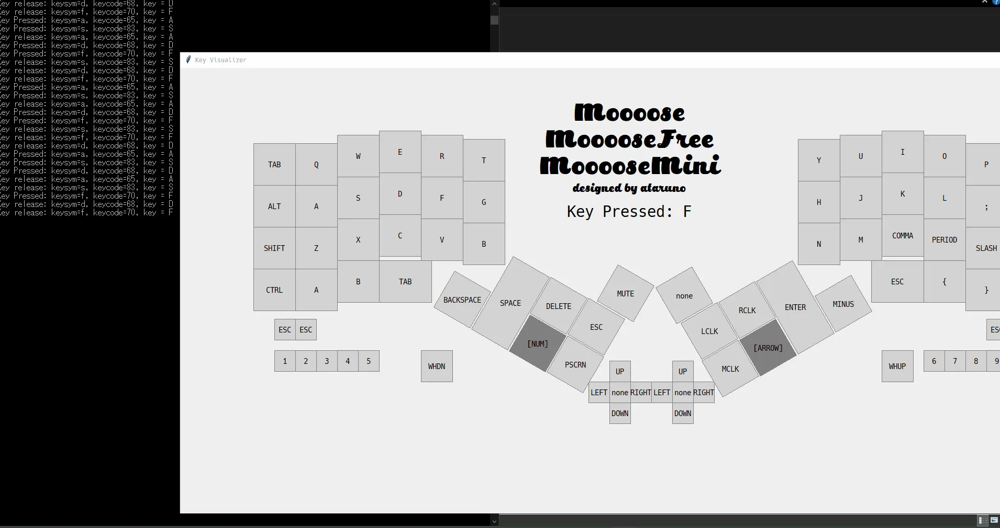

# KeymapViewer

## 概要
キーボード入力に応じて視覚的に押されたキーをWebブラウザ上で表示するビューワーです。  

## 特徴
* QMK互換JSONでレイアウトを設定
* ZMK風マクロ記法でキーマップを設定
* テーマ切り替え（ライト/ダーク/ブルー/グリーン/コンソール風）
* キャンバスはウインドウサイズに自動フィット
* キー押下時にリアルタイムでハイライト表示
* ログ表示機能

## 動作環境
- Webブラウザ（Chrome, Edge, Firefox, Safari等）
- サーバ不要、Netlify等の静的ホスティングで動作

## 使い方
1. `Layout JSON` にQMK互換のレイアウトJSONを貼り付け
2. `Keymap Macro` にZMK風のキーマップマクロを貼り付け
3. `Update Layout` ボタンで反映
4. キーボードを押すと該当キーがハイライトされます
5. テーマは右上のセレクトボックスで切り替え可能

## レイアウトJSON例
```json
{
  "layouts": {
    "layout_US": {
      "layout": [
        { "x": 0.0, "y": 0.0 },
        { "x": 1.0, "y": 0.0 }
        // ...省略...
      ]
    }
  }
}
```

## キーマップマクロ例
```
keymap {
  compatible = "zmk,keymap";
  default_layer {
    bindings = <
      &kp Q &kp W &kp E &kp R &kp T
      // ...省略...
    >;
  };
};
```

## ログ
画面上部に直近のキーイベントが表示されます。  


# Netlify 設定メモ

- **Base directory**: `/workspaces/KeymapViewer` または空欄（リポジトリ直下なら空欄でOK）
- **Build command**: `npm run build` または `yarn build`（React/Vite等のプロジェクトに合わせて）
- **Publish directory**: `frontend/dist`
- **Functions directory**: `netlify/functions`（必要な場合のみ）

## ポイント
- `frontend/dist` に `index.html` などがビルドされていればOK
- `Base directory` は通常リポジトリ直下（空欄）で問題ありません
- `Build command` を必ず指定してください（Netlifyが自動ビルドします）

## 例
- Base directory: （空欄、または `/workspaces/KeymapViewer` でも可）
- Build command: `npm run build`
- Publish directory: `frontend/dist`

