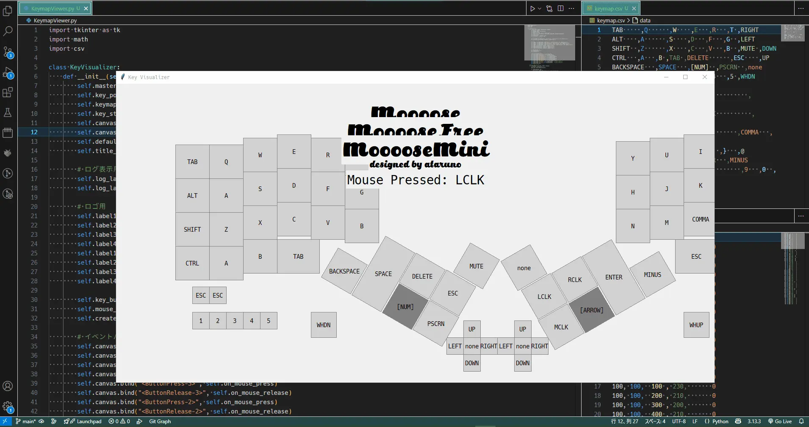

# KeymapViewer
## 概要
キーボード入力に応じて視覚的に押されたキーを表示するビューワーです。  
  

## 特徴
* keypos.csvでレイアウトを設定。  
* keymap.csvでキーマップを設定。  
  

## 動作環境
以下での動作確認済です。  
* python 3.13.3  
* 使用ライブラリ tkinter,math,csv  

## keypos.csv
keyposでは各キーのサイズ(w,h),位置(x,y),回転(r)を設定します。  
実行画面の左上が位置(0,0)です。  

## ログ
コマンドプロンプト上にログも表示されます。  

# Netlify 設定メモ

- **Base directory**: `/workspaces/KeymapViewer` または空欄（リポジトリ直下なら空欄でOK）
- **Build command**: `npm run build` または `yarn build`（React/Vite等のプロジェクトに合わせて）
- **Publish directory**: `frontend/dist`
- **Functions directory**: `netlify/functions`（必要な場合のみ）

## ポイント
- `frontend/dist` に `index.html` などがビルドされていればOK
- `Base directory` は通常リポジトリ直下（空欄）で問題ありません
- `Build command` を必ず指定してください（Netlifyが自動ビルドします）

## 例
- Base directory: （空欄、または `/workspaces/KeymapViewer` でも可）
- Build command: `npm run build`
- Publish directory: `frontend/dist`

