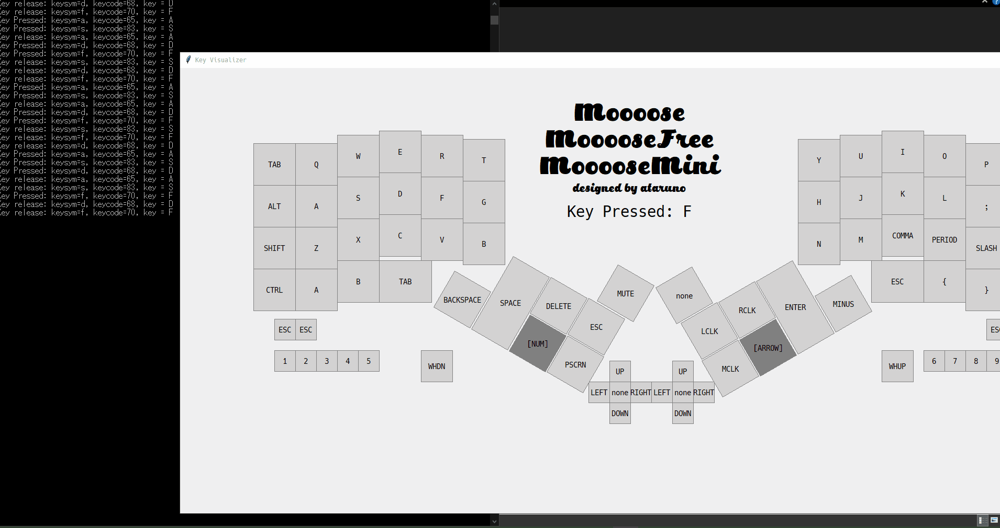

# KeymapViewer
## 概要
キーボード入力に応じて視覚敵に押されたキーがわかるビューワーです。  

## 特徴
keypos.csvでレイアウトを設定。  
keymap.csvでキーマップを設定。  

## 動作環境
以下での動作確認済です。  
python 3.13.3  
ライブラリ tkinter,math,csv  

## keypos.csv
keyposでは各キーのサイズ(w,h),位置(x,y),回転(r)を設定します。  
実行画面の左上が位置(0,0)です。  

## ログ
コマンドプロンプト上にログも表示されます。  

